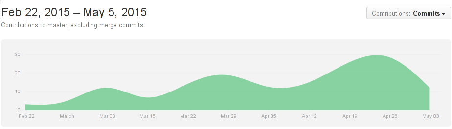
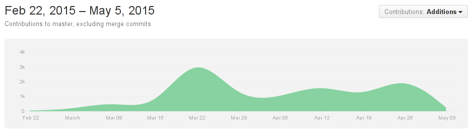
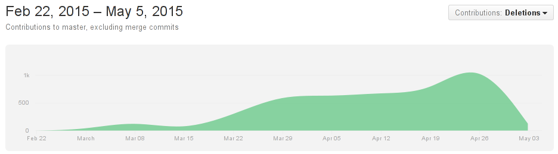

# The Dream

## Game Design

- block-based puzzle game framework
- highly customizable
    - modular design
    - powerups
    - create your own gametype
- multiplayer
    - net play
    - split screen
- build for the web, port to mobile devices

## Process

- maintain a blog
- collaborate using GitHub
    - work independently
    - issue tracking
    - weekly builds
- presentable by Quest
- coding standards

# The Reality

## Game Design

- customizable block-based puzzle game
    - board size
    - colors
- two gametypes built in
- no powerups
- single player only
- works in updated Firefox/Chrome, including mobile

## Process

- maintained a blog
- collaborated using GitHub
    - worked in lockstep until late in semester
    - issue tracking used sparingly
    - builds made whenever
- 1 week behind Quest
- adhered to most of our coding standards

## Complications

- underestimated development time
- JavaScript
    - `undefined == null`
    - *many* different approaches to *everything*
    - not very compatible with UML diagrams
- CutJS
    - "there's a new JS framework every 5 minutes"
    - in alpha, some experimental features
    - changed its *name* last month
        - StageJS

## Triumphs

- we all learned:
    - git
    - JavaScript
    - to develop software as a group
- made 2 pretty cool games

<http://ironkladd.github.io/rakushki>

## Going Back in Time

- use a more standard/stable library
- tone down the scope
- sprints early on

## Commits over Time

## Additions over Time

## Deletions over Time

## Personal Reflections

\begin{figure}
  \centering
  \includegraphics[height=0.9\textheight]{img/logo.png}
\end{figure}
